# GlassyBottomBar

A glassmorphism floating bottom navigation bar for Jetpack Compose. Features real backdrop blur, smooth animated pill items, full theme awareness, and a dead-simple API.

---

## Features

- **Real backdrop blur** - uses Android's `RenderEffect` API for genuine glass blur on API 31+
- **Graceful fallback** - solid frosted surface on API 30, no crashes, no broken UI
- **Animated pill items** - smooth expand/collapse with label on selection
- **Fully customizable** - colors, opacity, blur, corner radius, bar height, and more
- **Theme aware** - adapts automatically to light, dark, and system themes
- **Minimal API** - one composable, drop it in and you're done

---

## Installation

### Step 1 - Add JitPack to your repositories

In your `settings.gradle.kts`:

```kotlin
dependencyResolutionManagement {
    repositories {
        google()
        mavenCentral()
        maven { url = uri("https://jitpack.io") }
    }
}
```

### Step 2 - Add the dependency

In your `app/build.gradle.kts`:

```kotlin
dependencies {
    implementation("com.github.MrLincon:GlassyBottomBar:1.0.0")
}
```

### Step 3 - Sync

Hit **Sync Now** in Android Studio. That's it.

---

## Quick Start

The entire library is one composable - `GlassyBottomBarScaffold`. Wrap your `NavHost` inside it and you're done.

```kotlin
@Composable
fun MyApp() {
    val navController = rememberNavController()

    val items = listOf(
        FloatingNavItem(route = "home",     label = "Home",     iconRes = R.drawable.ic_home),
        FloatingNavItem(route = "search",   label = "Search",   iconRes = R.drawable.ic_search),
        FloatingNavItem(route = "profile",  label = "Profile",  iconRes = R.drawable.ic_profile),
        FloatingNavItem(route = "settings", label = "Settings", iconRes = R.drawable.ic_settings),
    )

    GlassyBottomBarScaffold(
        navController = navController,
        items = items
    ) { paddingValues ->
        NavHost(
            navController = navController,
            startDestination = "home"
        ) {
            composable("home")     { HomeScreen() }
            composable("search")   { SearchScreen() }
            composable("profile")  { ProfileScreen() }
            composable("settings") { SettingsScreen() }
        }
    }
}
```

No setup. No boilerplate. No manual state tracking. Just wrap and go.

---

## API Reference

### `GlassyBottomBarScaffold`

```kotlin
@Composable
fun GlassyBottomBarScaffold(
    navController: NavHostController,
    items: List<FloatingNavItem>,

    // Layout
    bottomPadding: Dp = 36.dp,
    barHeight: Dp = 66.dp,

    // Blur
    enableBlur: Boolean = true,
    blurRadius: Float = 0.5f,
    noiseFactor: Float = 0.2f,

    // Background - the glass bar itself
    bgTintColor: @Composable () -> Color = { MaterialTheme.colorScheme.surface },
    bgOpacity: Float = 0.05f,
    bgCornerRadius: Dp = 100.dp,
    disableBorder: Boolean = false,

    // Selected pill card
    selectedCardColor: @Composable () -> Color = { MaterialTheme.colorScheme.primary },
    unselectedCardColor: @Composable () -> Color = { MaterialTheme.colorScheme.surfaceVariant },
    cardOpacity: Float = 0.5f,
    cardCornerRadius: Dp = 100.dp,

    // Icon tint
    selectedIconColor: @Composable () -> Color = { MaterialTheme.colorScheme.onPrimary },
    unselectedIconColor: @Composable () -> Color = { MaterialTheme.colorScheme.onSurface },

    content: @Composable (PaddingValues) -> Unit
)
```

### `FloatingNavItem`

```kotlin
data class FloatingNavItem(
    val route: String,            // Navigation route string
    val label: String,            // Label shown when selected
    @DrawableRes val iconRes: Int  // Icon drawable resource
)
```

---

### Parameter Reference

#### Layout

| Parameter | Type | Default | Description |
|---|---|---|---|
| `bottomPadding` | `Dp` | `36.dp` | Space between the bar and the bottom edge of the screen |
| `barHeight` | `Dp` | `66.dp` | Height of the floating bar |

#### Blur

| Parameter | Type | Default | Description |
|---|---|---|---|
| `enableBlur` | `Boolean` | `true` | Enable or disable blur. When `false`, falls back to solid tint |
| `blurRadius` | `Float` | `0.5f` | Blur intensity from `0.0` (none) to `1.0` (maximum) |
| `noiseFactor` | `Float` | `0.2f` | Film grain/noise overlay from `0.0` (off) to `1.0` (heavy) |

#### Background (the glass bar)

| Parameter | Type | Default | Description |
|---|---|---|---|
| `bgTintColor` | `@Composable () -> Color` | `surface` | Tint color of the glass bar |
| `bgOpacity` | `Float` | `0.05f` | Opacity of the tint from `0.0` to `1.0` |
| `bgCornerRadius` | `Dp` | `100.dp` | Corner radius of the bar |
| `disableBorder` | `Boolean` | `false` | Hides the glassy border and shadow highlight. Recommended when `bgOpacity` is `1.0` |

#### Pill card (nav items)

| Parameter | Type | Default | Description |
|---|---|---|---|
| `selectedCardColor` | `@Composable () -> Color` | `primary` | Background color of the selected pill |
| `unselectedCardColor` | `@Composable () -> Color` | `surfaceVariant` | Background color of unselected pills |
| `cardOpacity` | `Float` | `0.5f` | Opacity of unselected pill backgrounds |
| `cardCornerRadius` | `Dp` | `100.dp` | Corner radius of the pill cards |

#### Icons

| Parameter | Type | Default | Description |
|---|---|---|---|
| `selectedIconColor` | `@Composable () -> Color` | `onPrimary` | Icon tint when the item is selected |
| `unselectedIconColor` | `@Composable () -> Color` | `onSurface` | Icon tint when the item is unselected |

---

## API Compatibility

| Android Version | API Level | Blur Support |
|---|---|---|
| Android 11 | 30 | ❌ Solid tint fallback |
| Android 12+ | 31+ | ✅ Full backdrop blur |

The library handles this automatically. You don't need to check API levels yourself.

---

## Examples

### 1. Default - works in all themes automatically

<p float="left">
  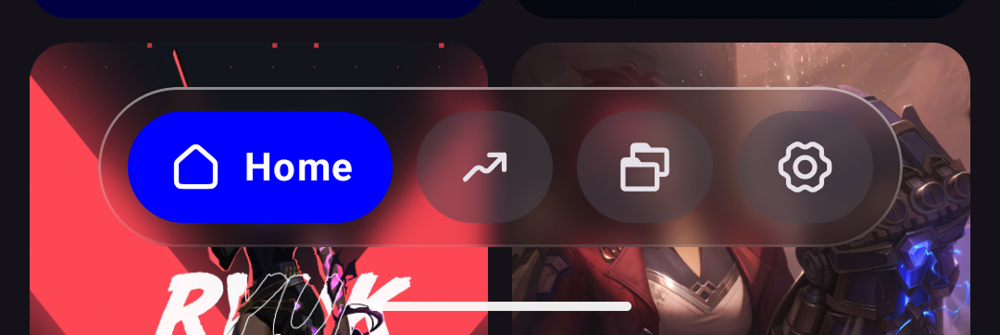
  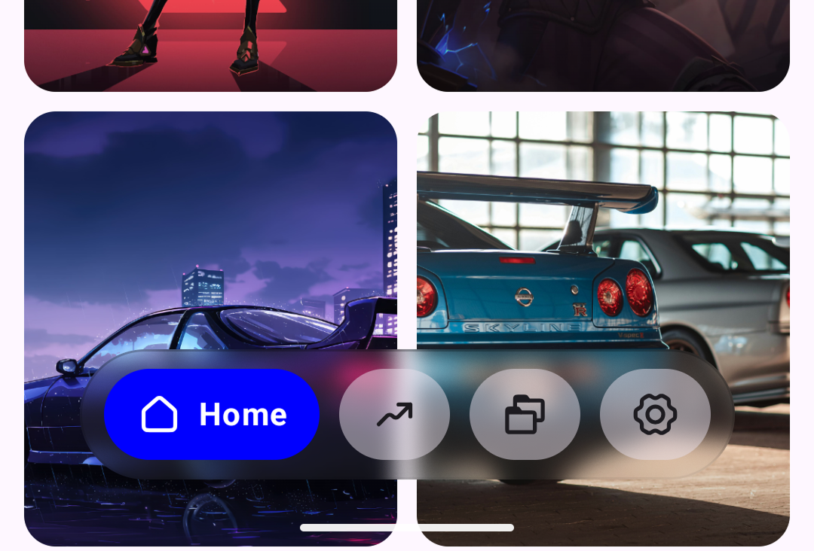
</p>

```kotlin
GlassyBottomBarScaffold(
    navController = navController,
    items = items
) { paddingValues ->
    NavHost(...)
}
```

---

### 2. Light mode - white frosted glass

<p float="left">
  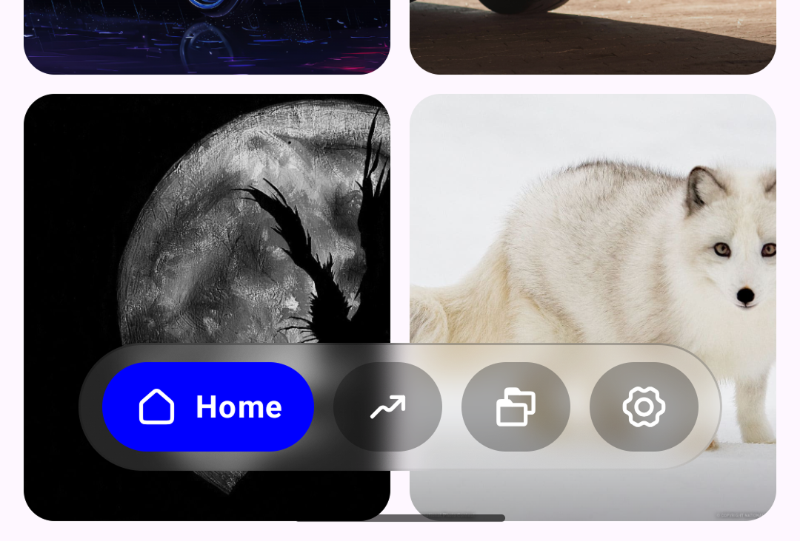
  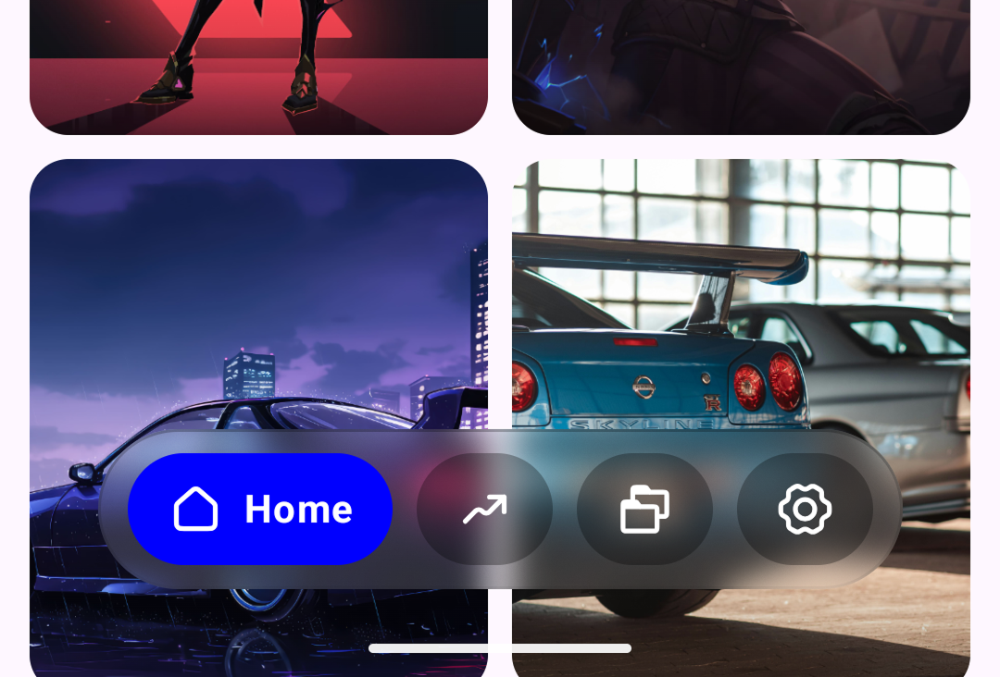
</p>

```kotlin
GlassyBottomBarScaffold(
    navController = navController,
    items = items,
    bgTintColor = { Color.White },
    bgOpacity = 0.15f,
    blurRadius = 0.6f,
    noiseFactor = 0.15f,
    selectedCardColor = { Color.Blue },
    unselectedCardColor = { Color.Black.copy(alpha = 0.5f) },
    cardOpacity = 0.3f,
    selectedIconColor = { Color.White },
    unselectedIconColor = { Color.White }
) { paddingValues ->
    NavHost(...)
}
```

---

### 3. Dark mode - dark frosted glass

<p float="left">
  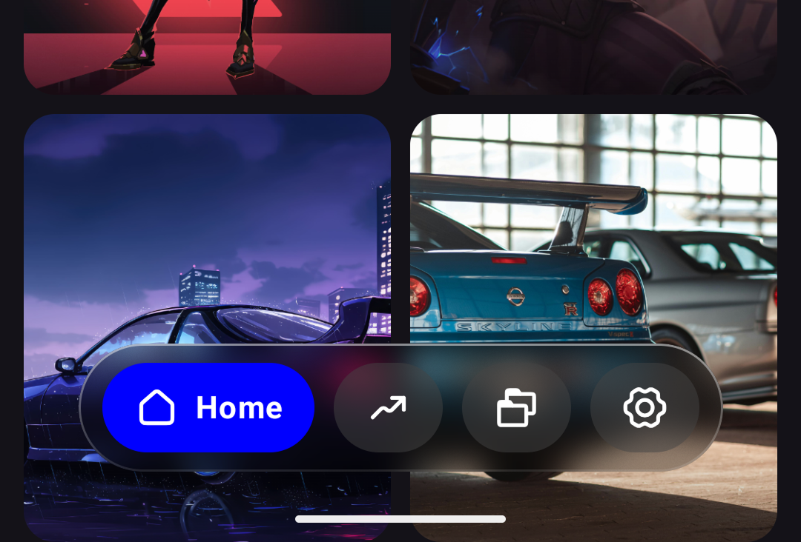
  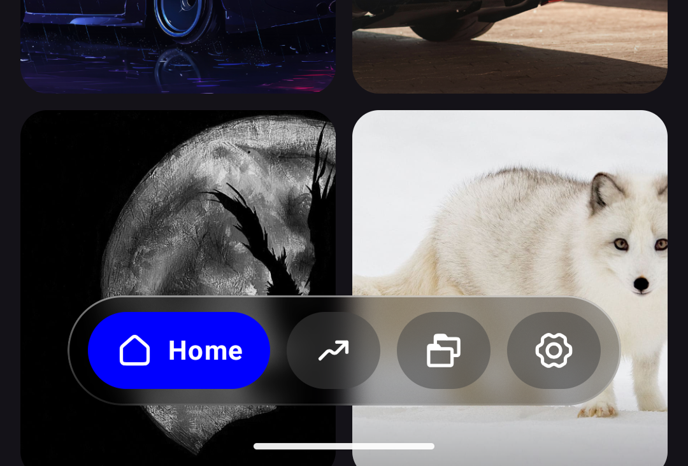
</p>

```kotlin
GlassyBottomBarScaffold(
    navController = navController,
    items = items,
    bgTintColor = { Color.Black },
    bgOpacity = 0.3f,
    blurRadius = 0.7f,
    noiseFactor = 0.2f,
    selectedCardColor = { Color.Blue },
    unselectedCardColor = { Color.DarkGray },
    cardOpacity = 0.5f,
    selectedIconColor = { Color.White },
    unselectedIconColor = { Color.White }
) { paddingValues ->
    NavHost(...)
}
```

---

### 4. Colored glass - purple tint

<p float="left">
  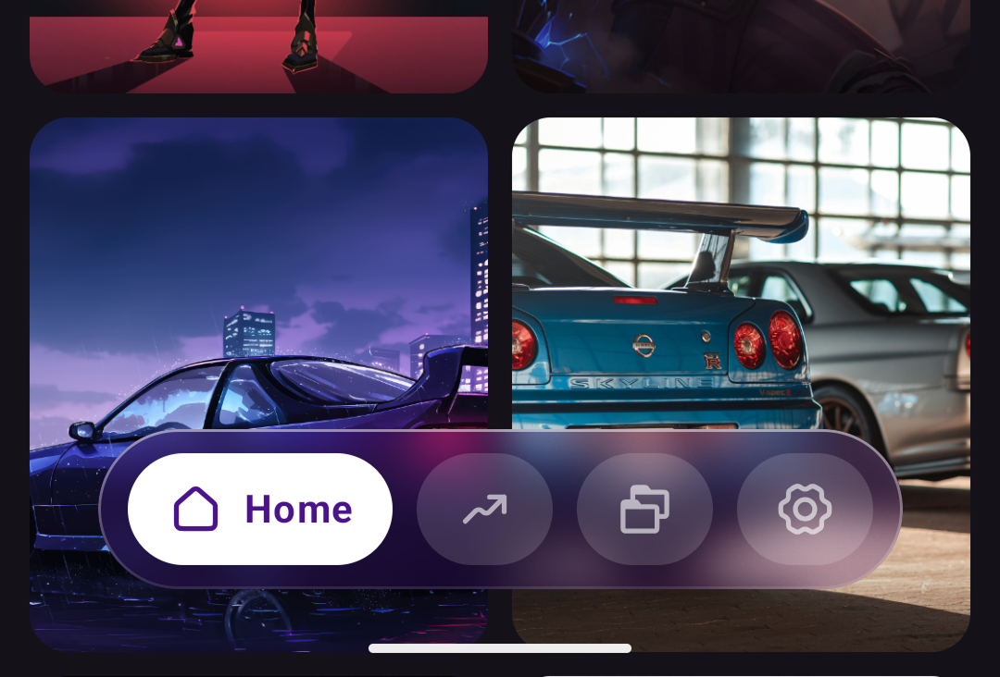
  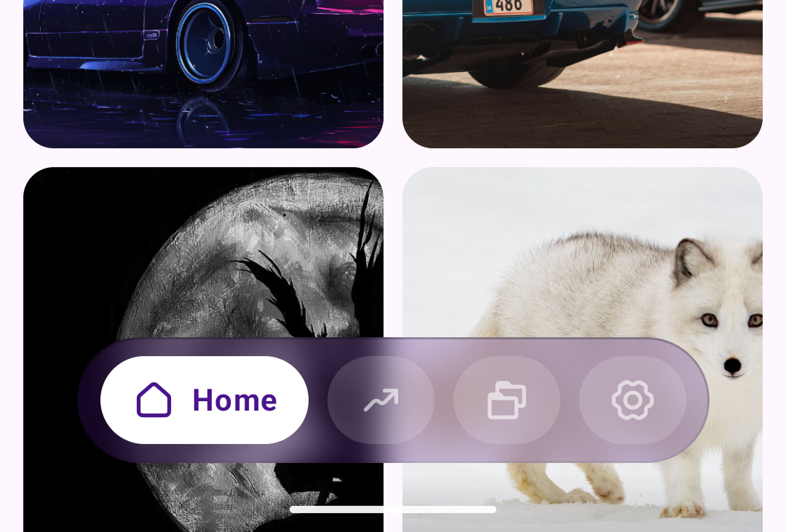
</p>

```kotlin
GlassyBottomBarScaffold(
    navController = navController,
    items = items,
    bgTintColor = { Color(0xFF4A148C) },
    bgOpacity = 0.25f,
    blurRadius = 0.8f,
    selectedCardColor = { Color.White },
    unselectedCardColor = { Color.White },
    cardOpacity = 0.15f,
    selectedIconColor = { Color(0xFF4A148C) },
    unselectedIconColor = { Color.White.copy(alpha = 0.6f) }
) { paddingValues ->
    NavHost(...)
}
```

---

### 5. Light mode - No blur

<p float="left">
  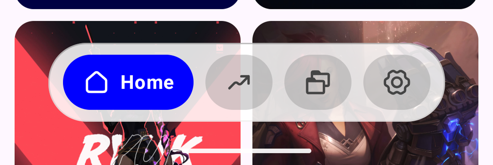
</p>

```kotlin
GlassyBottomBarScaffold(
    navController = navController,
    items = items,
    enableBlur = false,
    bgTintColor = { Color.White },
    bgOpacity = 0.95f,
    bgCornerRadius = 32.dp,
    selectedCardColor = { Color.Blue },
    unselectedCardColor = { Color.Gray },
    cardOpacity = 0.35f,
    selectedIconColor = { Color.White },
    unselectedIconColor = { Color.DarkGray }
) { paddingValues ->
    NavHost(...)
}
```

---

### 6. Material theme adaptive

The safest option - follows your app's theme in any mode automatically.

<p float="left">
  
</p>

```kotlin
GlassyBottomBarScaffold(
    navController = navController,
    items = items,
    bgTintColor = { MaterialTheme.colorScheme.surface },
    bgOpacity = 0.08f,
    blurRadius = 0.5f,
    selectedCardColor = { MaterialTheme.colorScheme.primary },
    unselectedCardColor = { MaterialTheme.colorScheme.surfaceVariant },
    cardOpacity = 0.5f,
    selectedIconColor = { MaterialTheme.colorScheme.onPrimary },
    unselectedIconColor = { MaterialTheme.colorScheme.onSurface }
) { paddingValues ->
    NavHost(...)
}
```

---

### 7. Minimal - icon-only feel

<p float="left">
  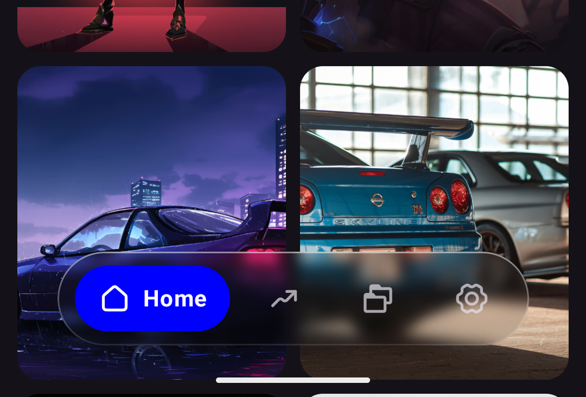
</p>

```kotlin
GlassyBottomBarScaffold(
    navController = navController,
    items = items,
    bgTintColor = { MaterialTheme.colorScheme.surface },
    bgOpacity = 0.1f,
    blurRadius = 0.4f,
    selectedCardColor = { MaterialTheme.colorScheme.primary },
    unselectedCardColor = { Color.Transparent },
    cardOpacity = 0f,
    selectedIconColor = { MaterialTheme.colorScheme.onPrimary },
    unselectedIconColor = { MaterialTheme.colorScheme.onSurface.copy(alpha = 0.7f) }
) { paddingValues ->
    NavHost(...)
}
```

---

### 8. Fully squared - no rounded corners

<p float="left">
  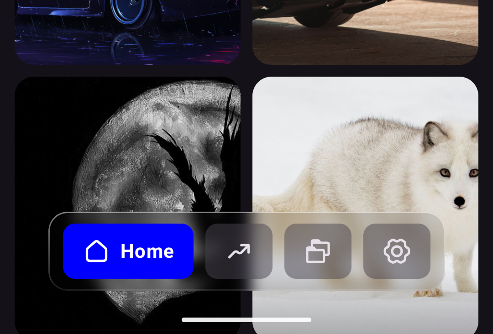
</p>

```kotlin
GlassyBottomBarScaffold(
    navController = navController,
    items = items,
    bgCornerRadius = 16.dp,
    cardCornerRadius = 10.dp,
    bgTintColor = { MaterialTheme.colorScheme.surface },
    bgOpacity = 0.12f,
    blurRadius = 0.5f
) { paddingValues ->
    NavHost(...)
}
```

---

### 9. Wallpaper app style - solid dark bar, no border

When `bgOpacity` is `1.0`, the bar is fully opaque and the glassy border no longer makes sense. Use `disableBorder = true` to hide it cleanly.

<p float="left">
  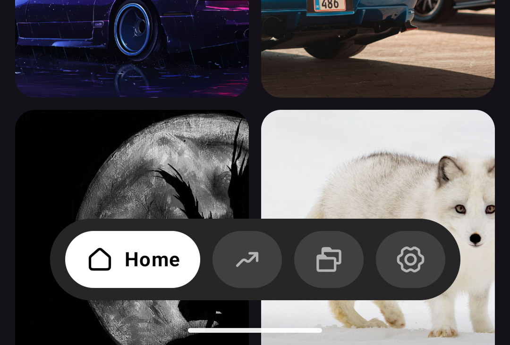
</p>

```kotlin
GlassyBottomBarScaffold(
    navController = navController,
    items = items,
    disableBorder = true,
    bgTintColor = { Color(0xFF262626) },
    bgOpacity = 1f,
    bgCornerRadius = 100.dp,
    selectedCardColor = { Color.White },
    unselectedCardColor = { Color.White },
    cardOpacity = 0.12f,
    selectedIconColor = { Color.Black },
    unselectedIconColor = { Color.White.copy(alpha = 0.6f) }
) { paddingValues ->
    NavHost(...)
}
```

---

## Content Padding

`GlassyBottomBarScaffold` automatically passes `PaddingValues` to your content so nothing hides behind the bar. Always apply it to your screen's root scrollable:

```kotlin
GlassyBottomBarScaffold(
    navController = navController,
    items = items
) { paddingValues ->
    LazyColumn(
        contentPadding = paddingValues // ← apply here
    ) {
        // your content
    }
}
```

---

## Troubleshooting

**Blur not showing?**
Blur requires API 31 (Android 12). On API 30, a solid tint fallback is shown automatically. Make sure `enableBlur = true` (default).

**Bar appears black/white unexpectedly?**
Set `bgTintColor` explicitly using a composable lambda:
```kotlin
bgTintColor = { Color.White } // always white regardless of theme
```

**Using dynamic color and primary doesn't match?**
Dynamic color on Android 12+ overrides your theme colors with system-generated ones. Disable it in your `Theme.kt`:
```kotlin
GlassyBottomBarTheme(dynamicColor = false) { ... }
```

**Border looks wrong on a solid opaque bar?**
The border is designed for glass/transparent surfaces. On fully opaque bars set `disableBorder = true`:
```kotlin
disableBorder = true,
bgOpacity = 1f
```

**Content hidden behind the bar?**
Apply the `paddingValues` passed by the scaffold to your screen content. See the Content Padding section above.

**Items not navigating correctly?**
Make sure the `route` in each `FloatingNavItem` matches exactly the route string used in your `NavHost` `composable()` calls.

---

## Requirements

- Min SDK: API 30 (Android 11)
- Jetpack Compose BOM: 2024.x+
- Navigation Compose: 2.7+

---

## License

```
MIT License

Copyright (c) 2026 Ahamed Lincon

Permission is hereby granted, free of charge, to any person obtaining a copy
of this software and associated documentation files (the "Software"), to deal
in the Software without restriction, including without limitation the rights
to use, copy, modify, merge, publish, distribute, sublicense, and/or sell
copies of the Software, and to permit persons to whom the Software is
furnished to do so, subject to the following conditions:

The above copyright notice and this permission notice shall be included in all
copies or substantial portions of the Software.

THE SOFTWARE IS PROVIDED "AS IS", WITHOUT WARRANTY OF ANY KIND, EXPRESS OR
IMPLIED, INCLUDING BUT NOT LIMITED TO THE WARRANTIES OF MERCHANTABILITY,
FITNESS FOR A PARTICULAR PURPOSE AND NONINFRINGEMENT. IN NO EVENT SHALL THE
AUTHORS OR COPYRIGHT HOLDERS BE LIABLE FOR ANY CLAIM, DAMAGES OR OTHER
LIABILITY, WHETHER IN AN ACTION OF CONTRACT, TORT OR OTHERWISE, ARISING FROM,
OUT OF OR IN CONNECTION WITH THE SOFTWARE OR THE USE OR OTHER DEALINGS IN THE
SOFTWARE.
```

---

## Author

Made with ❤️ by [Ahamed Lincon](https://github.com/MrLincon)

If this library helped you, consider leaving a ⭐ on GitHub - it means a lot.
